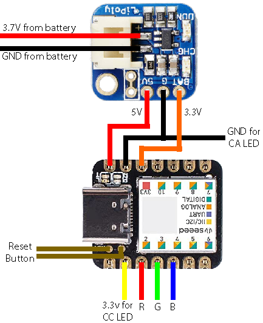

# sam-fusee-launcher
Fusee payload injector for the Seeed Studio Seeeduino XIAO. Based on [sam fusee laucher](https://github.com/noemu/sam-fusee-launcher), which is based on [sam fusee launcher](https://github.com/atlas44/sam-fusee-launcher).

# Hardware Needed
* [Seeeduino XIAO](https://www.amazon.com/gp/product/B09FSQM3K5/ref=crt_ewc_title_dp_1?ie=UTF8&psc=1&smid=A1YP59NGBNBZUR)
* [Adafruit LiPoly Backpack](https://www.amazon.com/Adafruit-Trinket-LiIon-LiPoly-Backpack/dp/B00SK697AU/ref=sr_1_1?crid=17DZC8FSOW9ZN&dchild=1&keywords=adafruit+lipo+backpack&qid=1633812236&sprefix=adafruit+lipo%2Caps%2C240&sr=8-1)
* Button (Literally any button will work)
* LiPo Battery (Any should work as long as it's a 3.7v LiPo, I just used what I had lying around)

### Wiring Diagram:

# Build and Install

### Create/Update the Payload
* Download your favorite payload from its appropriate repository
* Run the python script in the `tools/binConverter.py` folder with this command, replacing the path with your own:
`python binConverter.py "C:\pathToMyPayload\payloadName.bin`, or just drag the .bin file on the script to automatically add the path
* In the same folder as the .bin file is located, a new .h file should appear. Make sure the new file is named `hekate.h` if using hekate. Copy the new file to the `main` folder and choose to replace the old file
* **If using another payload:** change line 9 in main.ino from: `#include "hekate.h"` to: `#include "payloadName.h"`, replacing `payloadName` with the name of your payload of choice

### Install Board to IDE
Full guide: [Seeeduino XIAO software setup](https://wiki.seeedstudio.com/Seeeduino-XIAO/#software)

Quick Summary:
* Download and install arduino IDE http://www.arduino.cc/en/Main/Software
* In Arduino: go to "Prefences" and add to "Additional Board Manager URLs" following URL:  `https://files.seeedstudio.com/arduino/package_seeeduino_boards_index.json`
* Go to "Tools > Board > Board Manager" and select "Type: All" and
* Input "Seeeduino XIAO" in the search box
* Install "Seeed SAMD Boards"
* Select the Seeeduino XIAO with "Tools > Board > Seeeduino XIAO M0"

### IDE Setup
* Go to "Sketch > Include Library > Manage Libraries" and install USBHost and FlashStorage
* Connect the XIAO to your computer and double click the reset button
* Go to "Tools > Port" and select your conneted XIAO. (If the name does not show up, use Device Manager to find the proper COM port)
* Download this repository, open main/main.ino with Arduino IDE
* **Side note:** in line 3 and 4 of main.ino, there are 2 options. The file led_ca.h is the code for LEDs with a common anode, and led_cc.h is LEDs with a common cathode. If you are unsure which to use, the most common type of RGB LED is common anode, which also means common ground
* Lastly, make sure to verify the sketch first, and if no errors appear, press the upload button

### Usage

* Just plug it in when the blue light is blinking and the payload should inject automaticly
* If you want to inject again, press the reset button and the light should start blinking blue again
* **For AutoRCM users:** Make sure that your Switch is on before attempting to inject, as the injector doesn't output enough power to turn on the console

Status LED meanings:
* Blinking blue -> searching for Switch in RCM mode
* Red -> no Switch found
* Solid green, then off (except the power LED) -> finished successfully

# Thanks to:
* [noemu](https://github.com/noemu/sam-fusee-launcher)
* [atlas44](https://github.com/atlas44/sam-fusee-launcher)
* [CTCaer](https://github.com/CTCaer/hekate)
